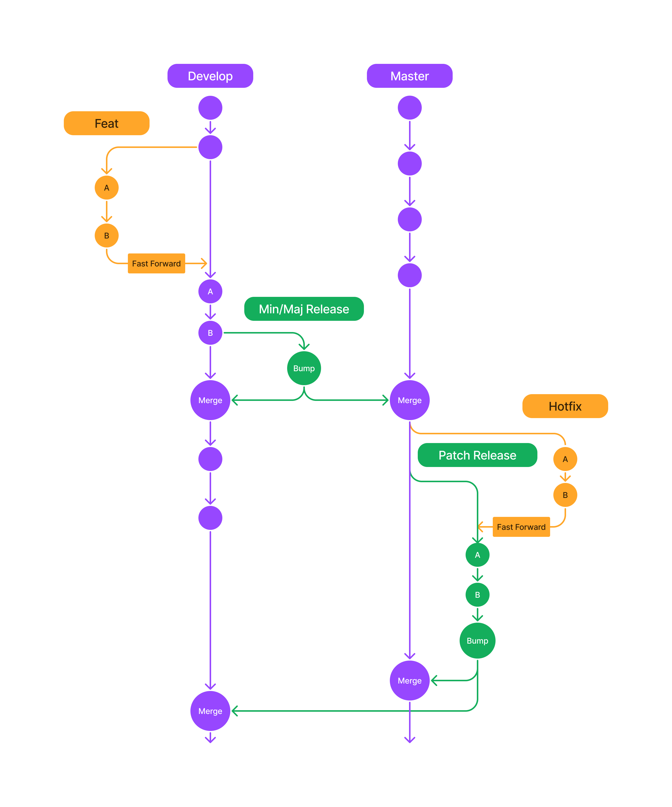

# Вклад в библиотеку v-uik

Это свод правил, которые помогут сделать качественный вклад в развитие библиотеки компонентов.

## Создание новых пакетов

Для упрощения и ускорения создания нового пакета(компонента) в проекте есть генератор файлов [hygen](http://www.hygen.io/). Он значительно ускоряет создание новой "заготовки" компонента. Проставляя все зависимости и создавая файловую структуру.

Для инициализации нового пакета используется команда `yarn generate PACKAGE_NAME`.

Где `PACKAGE_NAME` будет названием пакета, компонента и папки в storybook. Название пакета можно указывать в любом регистре. Он будет видоизменен под формат проекта, где название пакета в param-case, название компонента в PascalCase.

Или `yarn generate` и CLI предложит ввести название

Пример использования:

```shell
hygen generator package multi_select

Loaded templates: _templates
// создание компонента
added: packages/multi-select/src/MultiSelect.tsx
added: packages/multi-select/.eslintrc.json
added: packages/multi-select/src/index.ts
added: packages/multi-select/jest.config.js
added: packages/multi-select/package.json
added: packages/multi-select/README.MD
added: packages/multi-select/tsconfig.json
// создание примера в сторибуке
added: docs/showroom/stories/MultiSelect/story.mdx
added: docs/showroom/stories/MultiSelect/BasicMultiSelect.tsx
// инжект зависимостей в showroom и сам пакет
shell: lerna add "classnames" --scope="@v-uik/multi-select" && lerna add "@v-uik/theme" --scope="@v-uik/multi-select" --dev && lerna add "@v-uik/multi-select" --scope="@v-uik/showroom" --dev
```

На создание пакета требуется 5-10 секунд

## Именование коммитов

Для именования коммитов используйте [Соглашение о коммитах](https://www.conventionalcommits.org/ru/v1.0.0/). Пожалуйста, уделите этому моменту особое внимание, так как эти коммиты будут использоваться для создания автоматического отчета об
изменениях.

Сообщения коммитов должны быть следующей структуры:

```
<type>(<scope>): <subject>
<BLANK LINE>
<body>
<BLANK LINE>
<footer>
```

### Общие правила

Коммиты пишутся на русском языке, согласно требованиям Сбербанка, за исключением
ключевых слов — все типы из блока **Type**, все доступные **Scope**,
начало блока описания ломающих изменений **BREAKING CHANGE**, начало блока
описания устаревающих изменений **DEPRECATED**.

### Type

Должно быть одно из следующих значений:

- **build**: Изменения связанные со сборкой проекта
- **docs**: Изменения документации
- **feat**: Новая функциональность
- **fix**: Исправление багов
- **perf**: Улучшения производительности кода, БЕЗ ломающих изменений
- **refactor**: Улучшения, которые не добавляют новую функциональность или не исправляют багов, но улучшают
  качество или структуру кода, БЕЗ ломающих изменений
- **style**: Исправления форматирования кода (prettier, eslint)
- **test**: Добавление новых или исправление старых тестов

### Scope

В качестве значения используется имя существующего пакета. Если исправления касаются глобального скоупа, то `(<scope>)`
в заголовке коммита не указывается.

### Subject

Короткое описание изменений (до 100 символов), в повелительной наклонении, например
"исправь", а не "добавил" или "добавлено". С маленькой буквы. Без точки в конце.

### Body

Не обязательное поле. Дополняет поле `Subject`, объясняет, почему вы вносите
изменения. Вы можете включить сравнение предыдущего поведения с новым, чтобы проиллюстрировать влияние изменения.

Как и в `Subject`, используйте повелительное наклонение в настоящем времени:
"исправь", а не "добавил" или "добавлено".

### Footer

Содержит информацию о ломающих изменениях `BREAKING CHANGE` и устаревании кода
`DEPRECATED`, а также может содержать сноски на связанные тикеты в Jira или
прочие источники.

```
BREAKING CHANGE: <breaking change summary>
<BLANK LINE>
<breaking change description + migration instructions>
<BLANK LINE>
<BLANK LINE>
Исправляет #<issue number>
```

or

```
DEPRECATED: <what is deprecated>
<BLANK LINE>
<deprecation description + recommended update path>
<BLANK LINE>
<BLANK LINE>
Закрывает #<pr number>
```

### Отменяющие коммиты

Если коммит отменяет ранее сделанные изменения, он должен начинаться с `revert:` в блоке с `Type`
вашего отменяющего коммита.

Тело отменяющего коммита должно содержать:

- SHA коммита, который будет отменен: `This reverts commit <SHA>`,
- четкое описание причины отмены.

### Примеры коммитов

| Commit message                                                                                                                                                         | Release type               |
| ---------------------------------------------------------------------------------------------------------------------------------------------------------------------- | -------------------------- |
| `fix(button): исправь цвет текста`<br><br>`Замени токен onPrimeryHigh на onPrimaryMedium согласно макету.`                                                             | ~~Patch~~ Fix Release      |
| `feat(button): добавь свойство overflow`<br><br>`Добавь обрезание текста многоточием для нового свойства overflow.`                                                    | ~~Minor~~ Feature Release  |
| `refactor(button): переименуй свойство type`<br><br>`BREAKING CHANGE: Так как свойство type было переименовано в kind, сделйате соответвующее изменение в вашем коде.` | ~~Major~~ Breaking Release |

### Помощник написания коммитов

Для удобства создания коммитов через CLI, в проекте подключена библиотека
[commitizen](https://github.com/commitizen/cz-cli), которая предоставляет
интерфейс для пошагово создания всех блоков коммита.

### Генерация журнала изменений CHANGELOG.md

Для генерации журнала изменений, на основе коммитов с момента последнего тега, которые соответствуют шаблону "Feature", "Fix", "Performance Improvement" or "Breaking Changes", необходимо установить новый тег и запустить команду:

```bash
yarn changelog
```

Генерация журнала изменений осуществляется средствами пакета [standard-changelog](https://www.npmjs.com/package/standard-changelog).

## Чек-лист перед отправкой pull request на review

- Решение находится в отдельной ветке, которая создана от develop ветки
- Имена коммитов соответствуют разделу Именование коммитов в **CONTRIBUTING.md**
- Внешний вид компонентов соответствует макету, и имена свойств и состояний согласуются с макетом
- Использована система токенов и проверено отображение компонентов в темной теме
- Для вашего кода есть все примеры
- Для вашего кода написаны юнит тесты
- Для вашего кода добавлены тест кейсы для интеграционного и визуального тестирования

## Флоу pull request

1. Создать пул реквест
2. ПР билд должен проходить успешно
3. При получении замечаний по ревью исправления добавляются в новых коммитах без переписывания истории
4. Когда замечаний больше нет, коммиты с правками ревью приклеиваются к первому коммиту через fixup таким образом, чтобы на выходе получился один коммит с корректным названием
5. Пул реквест вливается в нужную ветку

## F.A.Q.

### Я допустил ошибку в коммите, как исправить недочет?

В статье [Переписывание истории](https://www.atlassian.com/ru/git/tutorials/rewriting-history)
подробно рассказывается о доступных методах изменения истории Git.

### Когда я могу менять историю коммитов?

**Разрешается** менять историю коммитов:

- в рабочих ветках

### Модель ветвления


